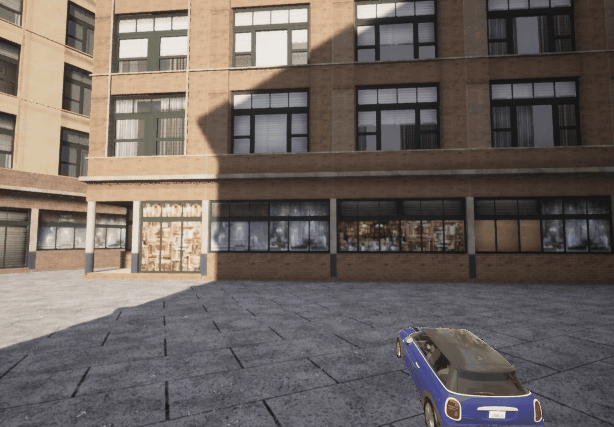

### Frame Annotator

Preparing high-quality datasets for Machine Learning activities requires much time and effort. Leveraging the power of mobile SAM [3,2,1,4] (segment-anything) can be achieved easily. This project presents a simple segmentation by mouse click.Accepted input types are ```web-cam-by-index, *.mp4, *.jpg, *.png, *.meta```.

<p align="center"> 
  </a>
  <div align="center">Segmentation result, recorded with CARLA [6]"</div>
</p>

As a post-processing step, the segmented images can be overlayed on different random backgrounds, with different positions and sizes. Use ```training_sampe_gen.py```, as output a ".meta" file will be generated, that holds the bounding box positions, and label of the object.

<p align="center"> 
  </a>
  <div align="center">Training set generated, backgrounds with CARLA [6]"</div>
</p>


### Installation

Is recommended to use a conda environment for this installation.

1. conda create --name fsannotator python=3.10, activate environment
2. if you have CUDA installed and want to use the GPU, check "nvidia-smi" for CUDA version (i.e. 11.2). Check pytorch versions [5], for the corresponding installation of the components. use the corresponding ```pip``` variant.
3. clone this project ```git clone https://github.com/fvilmos/frame_annotator```
4. install segment_anything : ```pip install git+https://github.com/facebookresearch/segment-anything.git```
5. install MobileSAM: ```pip install git+https://github.com/ChaoningZhang/MobileSAM.git```
6. download weights ```https://github.com/ChaoningZhang/MobileSAM/blob/master/weights/mobile_sam.pt```, copy into the ```./weights``` folder.
7. configure your data collection strategy in the ```./utils/fa_cfg.json``` file.

### Configuration

All data capture-related information is in the ```./utils/fa_cfg.json``` file, take a look into it to understand the parameters.
The training set generator ```training_sampe_gen.py``` has it's own configuration file ```./utils/ts_cfg.json```.

### Resources
1. [segment-anything](https://github.com/facebookresearch/segment-anything)
2. [MobileSAM](https://github.com/ChaoningZhang/MobileSAM.git)
3. [FASTER SEGMENT ANYTHING: TOWARDS LIGHTWEIGHT SAM FOR MOBILE APPLICATIONS](https://arxiv.org/pdf/2306.14289.pdf)
4. [Segment Anything](https://arxiv.org/pdf/2304.02643.pdf)
5. [torch CUDA enabled versions](https://pytorch.org/get-started/previous-versions/)
6. [CARLA simulator](https://carla.org/)


/Enjoy.